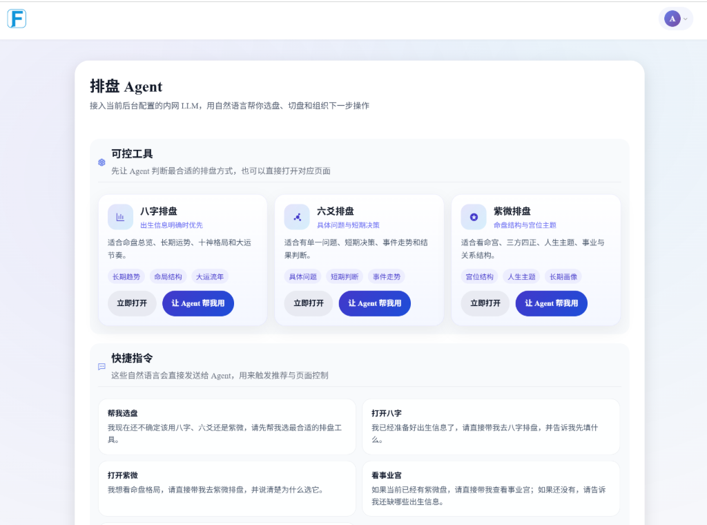
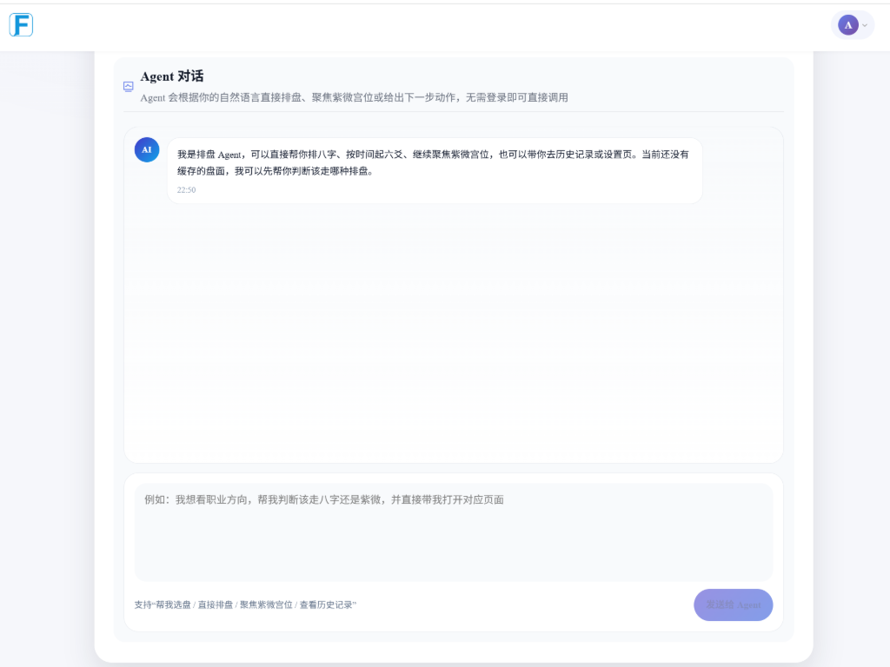
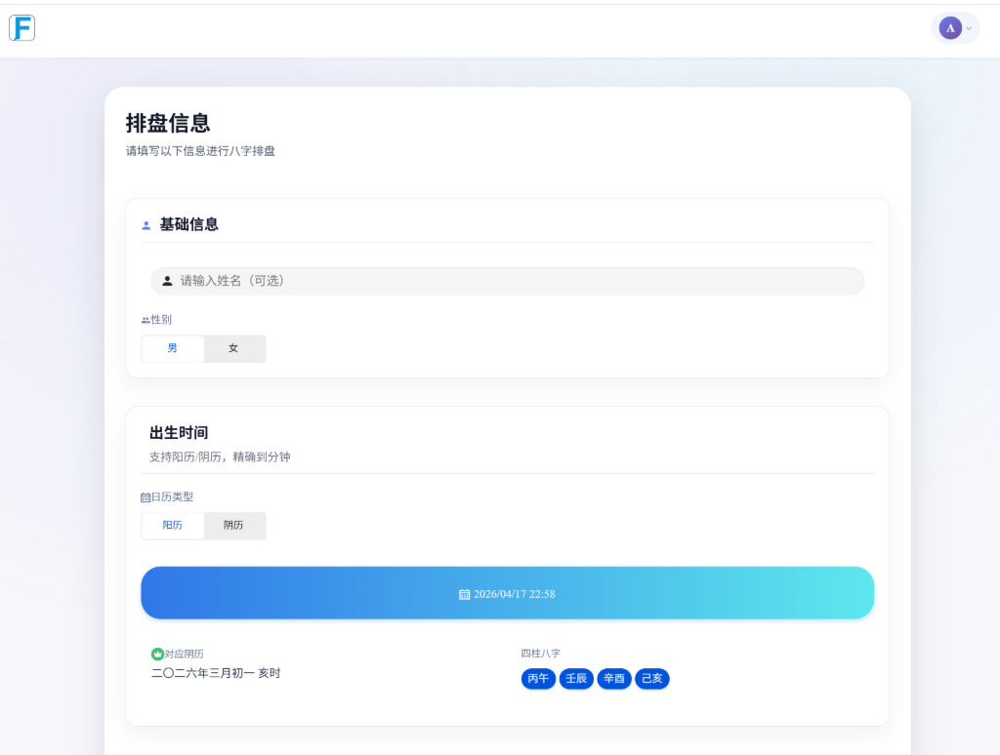
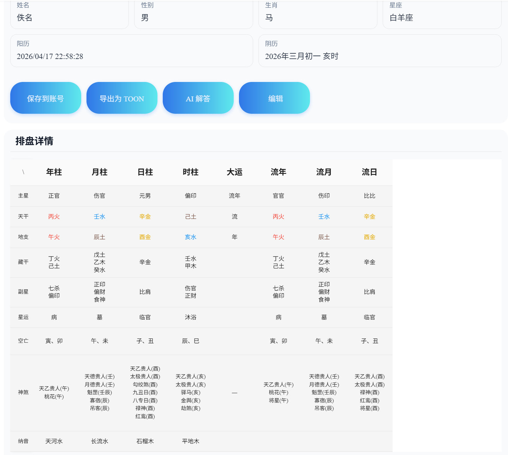
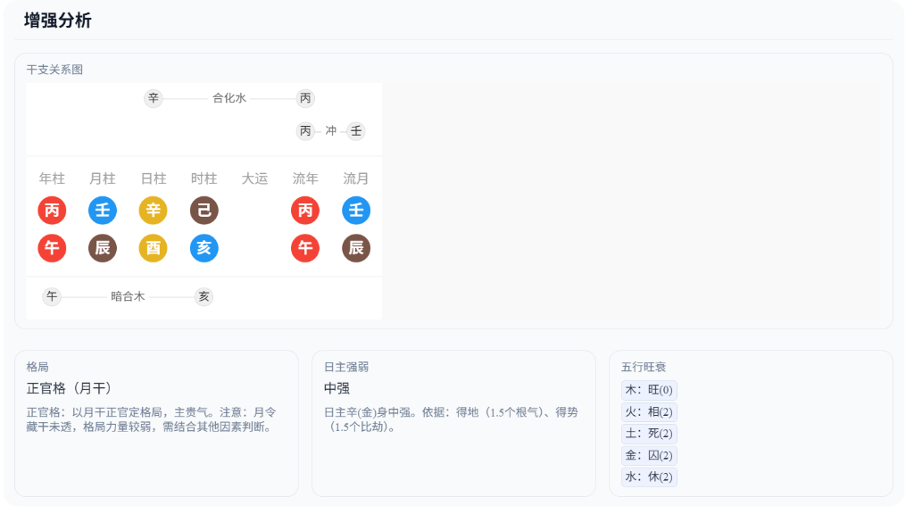
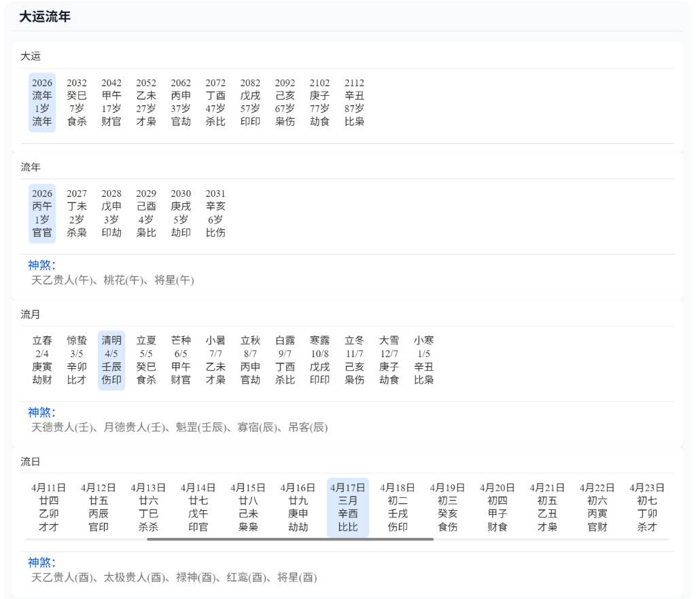
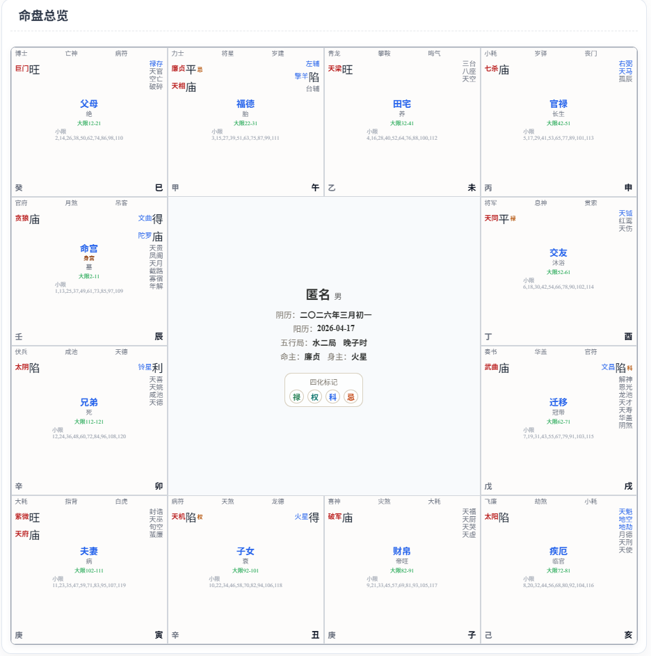
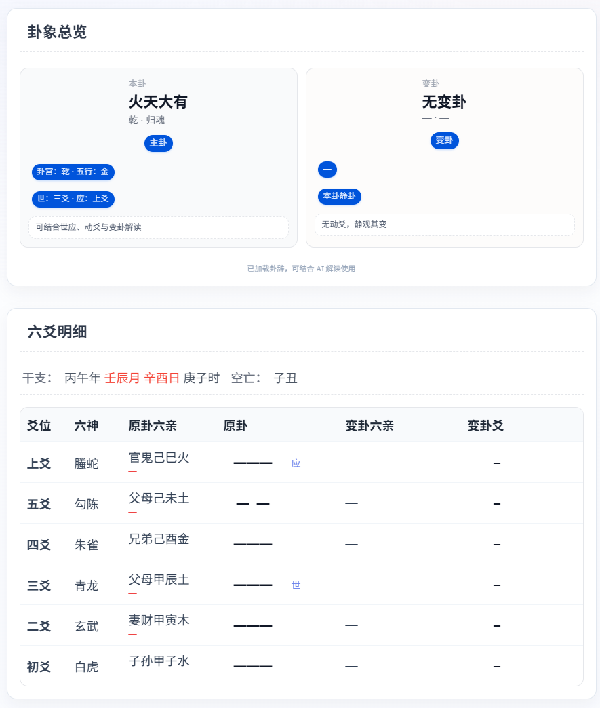

# 玄学AI Chat & Agent

基于 AI Agent 的玄学排盘系统，支持八字/六爻/紫微排盘。

## 项目结构

```
.
├── backend-docker/          # Node.js + Express 后端
│   ├── routes/             # API 路由
│   ├── services/           # 业务服务
│   ├── middleware/         # 中间件
│   ├── security.js         # 安全防护工具
│   ├── security-middleware.js  # 安全中间件
│   ├── admin-ui/           # 管理端前端
│   └── .env.example        # 环境变量模板
├── frontend-docker/        # 用户前端 (uni-app)
│   ├── src/
│   │   ├── features/agent/ # Agent 核心逻辑
│   │   ├── pages/         # 页面组件
│   │   └── store/         # 状态管理
│   └── Dockerfile
└── docker-compose.deploy.example.yml  # 部署配置模板
```

## 前置要求

- **Node.js** >= 16.0.0
- **npm** >= 8.0.0
- **MySQL** 8.0+
- **Docker & Docker Compose**（可选，用于容器化部署）

## 快速开始

### 本地开发

**后端**

```bash
cd backend-docker
npm install
cp .env.example .env
# 编辑 .env 填写必要配置
npm run dev
```

**用户前端**

```bash
cd frontend-docker
npm install
npm run dev:h5
```

**管理端**

```bash
cd backend-docker/admin-ui
npm install
npm run dev:h5
```


访问：

- 用户端：<http://localhost:3000>
- 管理端：[http://localhost:3002](http://localhost:3001)

## 核心功能

- **八字排盘**：四柱排盘、十神分析、大运流年
- **六爻排盘**：时间起卦、手动起卦、卦象分析
- **紫微斗数**：命盘生成、十二宫位、星曜分析
- **AI Agent**：自然语言交互、智能排盘调度
- **管理系统**：用户管理、记录管理、LLM 配置

## 界面预览

### AI Agent

|               排盘 Agent 首页               |                 Agent 对话                |
| :-------------------------------------: | :-------------------------------------: |
|  |  |

### 八字排盘

|                  排盘输入                 |                  排盘结果                  |
| :-----------------------------------: | :------------------------------------: |
|  |  |

|                   增强分析                   |                  大运流年                 |
| :--------------------------------------: | :-----------------------------------: |
|  |  |

### 紫微斗数



### 六爻排盘



## 安全特性

### 全局防护

- Host 头部注入防护（Nginx + 后端双重验证）
- CORS 白名单验证
- SQL 注入防护
- XSS 防护
- 请求速率限制
- Content Security Policy (CSP)
- 输入验证与清理
- API 请求签名验证

### 聊天界面防护

- **WebSocket 身份认证**：JWT Token 验证，无效或过期 Token 立即断开连接
- **消息频率限制**：每用户每分钟最多 5 条消息，防止滥用
- **额度管控**：每次对话前检查用户 LLM 额度，超额自动拒绝
- **输入验证**：严格校验消息格式（JSON 解析、数组类型检查）
- **错误信息脱敏**：服务端错误经脱敏处理后返回，防止敏感信息泄露
- **LLM 响应清理**：自动剥离 Ollama 思考块等内部标记，过滤 HTML 标签
- **安全日志记录**：记录 4xx/5xx 请求但过滤正常业务错误，便于安全审计

## 技术栈

- **后端**: Node.js, Express, MySQL
- **前端**: Vue 3, TypeScript, uni-app
- **AI**: 多模型适配 (Gemini, Ollama, Anthropic)
- **部署**: Docker, Docker Compose
- **安全**: 多层安全防护中间件

## 环境变量配置

本项目使用 `.env` 文件管理敏感配置。各模块的 `.env` 文件**不会被提交到仓库**，需自行从 `.env.example` 复制并填写：

```bash
# 后端
cd backend-docker
cp .env.example .env
# 编辑 .env，至少配置 JWT_SECRET、API_SIGNATURE_SECRET、数据库密码

# 前端
cd frontend-docker
cp .env.example .env
# 编辑 .env，配置 API_SIGNATURE_SECRET

# 管理端
cd backend-docker/admin-ui
cp .env.example .env
# 编辑 .env，配置 API_SIGNATURE_SECRET
```

详细配置项请参考各目录下的 `.env.example` 文件中的注释说明。

## Docker 部署

```bash
# 复制部署配置
cp docker-compose.deploy.example.yml docker-compose.deploy.yml

# 编辑 docker-compose.deploy.yml，替换所有 CHANGE_ME 值
# 包括数据库密码、JWT_SECRET、API_SIGNATURE_SECRET 等

# 拉取镜像并启动
docker compose -f docker-compose.deploy.yml pull
docker compose -f docker-compose.deploy.yml up -d
```

访问：
- 用户端：`http://localhost:3000`
- 管理端：`http://localhost:3002`

## 免责声明

本项目所有内容**仅供娱乐与学习研究**，不构成任何专业建议。玄学文化源远流长，请勿过度依赖或迷信。生活中的重要决策，请结合实际情况理性判断。

## 关于对玄学的看法

### 玄学是什么

玄学这个词，在当代语境下承载了太多含义。有人把它等同于迷信，有人把它视为传统文化的瑰宝，有人用它来寻求心理安慰，也有人试图从中找到某种"规律"。

我的理解是：玄学是一套古老的认知框架。在科学方法论尚未成型的年代，古人面对充满不确定性的世界，用观察、归纳、类比的方式，试图建立一套解释万物的体系。这套体系未必经得起现代实证的检验，但它本身是一种认真的、系统的思维尝试。

### 为什么不应该简单地否定

很多人一提到玄学就嗤之以鼻，认为这是愚昧的产物。但如果你真的去读《易经》的卦辞爻辞，去研究六爻纳甲的排盘逻辑，去理解八字中天干地支的生克制化关系，你会发现这些东西并不是胡编乱造的。它们有严密的内部逻辑，有自洽的推演规则，有数千年的经验积累。

否定一个东西，至少要先了解它。不了解就否定，和不了解就盲信，本质上是一样的——都是放弃思考。

### 为什么不应该盲目地相信

反过来，把玄学当作真理来信奉，同样是有问题的。

玄学的核心困境在于：它的理论体系是封闭的、自洽的，但未必与客观世界有真实的因果关联。一个八字排盘可以告诉你"日主偏弱，喜印比"，但这个判断和一个人真实的命运之间，是否存在可验证的因果关系？目前没有任何严谨的研究能证明这一点。

更危险的是确认偏误。当玄学的解释足够模糊和灵活时，人总是能从事后找到"应验"的证据，而忽略那些没有应验的部分。这种心理机制让人越信越深，却离真实越远。

### 关于"准不准"的问题

这是被问得最多的问题。我的回答是：这个问题本身就问错了。

"准不准"隐含的前提是，玄学是一种预测工具，它的价值取决于预测的准确率。但如果你用这个标准来衡量，玄学经不起检验——没有任何玄学体系能在严格的双盲实验中表现出统计显著的预测能力。

但这不意味着玄学毫无价值。一个心理咨询师不会告诉你"你明年三月会升职"，但他帮你理清思路、缓解焦虑，这个价值是真实的。玄学的价值也不在于预测，而在于它提供了一套语言和框架，让人能够把模糊的处境具象化，把混沌的情绪结构化。

### 数据说话：玄学比赛的真实正确率

如果一定要谈"准不准"，那就用数据来说话。

目前最权威的玄学比赛是香港青年术数家协会主办的**全球算命师大赛**，已举办16届。赛制为8个命例、40道四选一选择题，有明确标准答案，由8位老师实名出题，统计时剔除最高和最低分各5题，以中间30题计最终成绩。

**历年冠军准确率：**

| 年份 | 冠军准确率 | 季军准确率 |
|------|-----------|-----------|
| 2025 | 50.0% | 45.0% |
| 2024 | ~50% | - |
| 2023 | 37.5% | 32.5% |
| 2022 | 40.0% | 35.0% |

四选一选择题，纯随机猜测的正确率是25%。冠军准确率在37.5%~50%之间，大多数年份在40%~50%。这个成绩说明命理推断确实包含一定的信息量——毕竟显著高于随机基线——但远未达到"神断"的程度。

**AI大模型的表现：** 基于BaziQA基准测试（200道大赛真题），主流大模型的准确率在32%~40%之间，同样显著高于25%的随机基线，但低于人类冠军。搭载结构化推理协议的专用命理AI可达42%。一个有意思的发现是：主打逻辑推理的模型在八字测试中反而略逊于对话版，说明命理推理不完全等同于数学逻辑，它更依赖对语境和传统语义的深层理解。

这些数据印证了一个判断：玄学不是纯粹的随机游戏，但也绝不是可靠的预测工具。它处于"比瞎猜好，但远不够精确"的区间。这个区间恰好对应了它的合理定位——一种辅助思考的框架，而非决策的依据。

### AI在玄学领域的真正意义

AI擅长的是模式识别和概率计算。而玄学本质上也是一套基于模式的推演体系——天干地支的组合、五行的生克、卦象的变化，这些都可以被形式化、被编码。所以用技术来实现排盘、来辅助解读，是完全可行的，甚至比人工更精确、更高效。

然而AI在玄学中的应用的真正意义，不是"预测"，而是"正向引导"，是与心理学的融合。

在每一个大语言模型的训练过程中，心理学的资料收集、清理、标注，以及训练、预测、评估都是不可少的。正因如此，在大部分情况下，AI在解读玄学排盘信息的最后，都会提供一些正向引导，例如：放宽心、灵活应变、保持独立思考等等。而这些给出的建议和引导，就像是在你的人生中出现了一位专业的心理咨询师或一位稳重见多识广的长辈，帮助你了解自己的现状，理清现在的头绪，并在最后安抚你的情绪。

因此，相较于对玄学信息的训练和预测，心理学的引导才应该是一个解卦AI的核心。

同时，不同于人类卦师的有浓烈个人倾向、主观且极易被偏见、鬼神、恐惧影响的解读。AI的回答的本质，是transformer模型在多头注意力机制的作用下，基于以往训练信息的基础上，通过概率公式的计算，所得出的一份"基本客观"的结果。且token的价格是及其低廉，甚至免费的，因此AI解答并不会像人类卦师那样，给求卦者带来任何的经济负担。

我个人武断地猜测，有超过80%的对玄学（包括八字、星座、风水、教派等）感兴趣的普通人，基本都是希望通过这种"预测未来"的方式，来了解自己的未来、寻找心理或身体上的依靠、或者是想要学习一门"极其特殊"的手艺。对于那些正在经历挫折和迷茫的人，一个客观理性、不会为了私利而到处散播恐惧（如血光之灾、花钱消灾、子女克亲、风水恐吓、鬼魂附身等等）的AI，才是真正值得的选择。

### 最后

玄学不是科学，但也不是毫无价值的糟粕。它是一种古老的智慧形态，有它的局限，也有它的独特之处。

保持好奇，保持怀疑，保持独立思考。就像现在的医学、法律、金融等，这些领域直到如今都没有人能够对任何事物完全确定，之前被奉为圭准的新发现，在几十年后也可能会被推翻；被几十亿人遵行的法律，也会因为新的发现和民情而被重新评估。保持好奇、保持怀疑、保持独立思考，是对待任何事物的最合理的态度，也是铺垫和促进玄学这一知识体系发展的底层基础和动力。

## 贡献指南

欢迎提交 Issue 和 Pull Request！

- **Bug 反馈**：请附上问题描述、复现步骤、平台信息及截图
- **功能建议**：请说明使用场景和期望效果
- **代码贡献**：请保持代码风格一致，提交前运行 lint 检查

## 许可证

本项目采用 GNU Affero General Public License v3.0 (AGPL-3.0) 许可证。

## 鸣谢

- [toon-format/toon](https://github.com/toon-format/toon) - Token-Oriented Object Notation
- [axbug/8Char-Uni-App](https://github.com/axbug/8Char-Uni-App) - 基于 Uni-APP 的八字排盘工具
